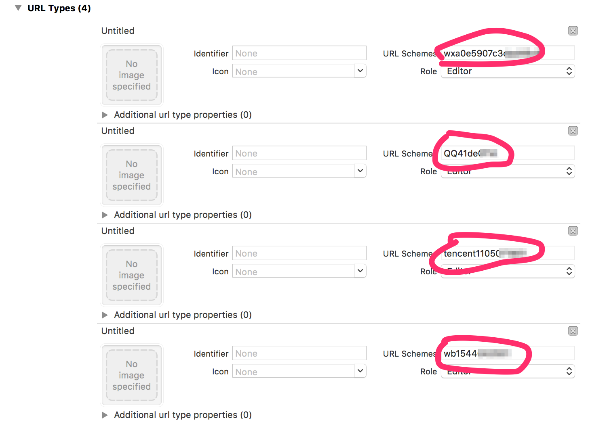

# STShareTool

常见的社会化分享，包含（QQ、QQ控件、微信好友、微信朋友圈、新浪微博）

没有一次和三方打交道是愉快的，尤其是三方分享、三方登录、三方支付、三方地图等等。这些都是非常常用的组件，iOS9 出来以后，又对安全性做了要求，配置相当繁琐，所以干脆封装了，记录一下流程。

## 申请 AppKey

第一步就是先去各个平台上申请 AppKey。

### QQ 开放平台

[http://open.qq.com](http://open.qq.com)

该平台申请的包含 QQ 和 QQ 空间。暂时没发现有什么需要注意的地方。

### 微信开放平台

[http://open.weixin.qq.com](http://open.weixin.qq.com)

该平台申请的包含 微信好友 和 微信朋友圈。

### 微博开放平台

[http://open.weibo.com](http://open.weibo.com)

呵呵呵呵呵呵，最坑的就是微博了好吗。

-   记着文案要符合要求：应用的作用、使用方法什么的。
-   应用地址，如果还没上线的话，可以先用默认 URL 占位：https://itunes.apple.com/cn/genre/yin-le/id34。
-   设置安全域名为：sns.whalecloud.com。
-   应用介绍图片，记着要有【新浪微博】的标示（icon 什么的，表示该页面有分享）。
-   在应用信息->高级信息里面，将授权回调和取消授权回调设置为：http://sns.whalecloud.com/sina2/callback。

### 友盟

[http://www.umeng.com](http://www.umeng.com)

## 工程配置

### 导入库

-   ImageIO.framework
-   libz.tbd
-   libstdc++.tbd
-   CoreTelephony.framework
-   libsqlite3.tbd
-   CoreGraphics.framework
-   SystemConfiguration.framework
-   libiconv.tbd
-   Security.framework

### 配置 Build Setting

找到 Other Linker Flags ，添加两项 -all_load 和 -ObjC。要不然会报 wb…base64...的错，运行就崩溃好吗。

配置完，别忘了 Clean 一下，防止有缓存。

### 配置 URL Types

点击工程名称，找到 info 选项卡，找到最后的 URL Types 。

添加四个 URL Types。分别是 QQ 、微信、微博。（ 对 QQ 要配置两个，所以三个平台要有四个 URL Types...

只用填写 URL Schemes 就行，规则如下：

-   微信：直接是微信的 AppId。
-   QQ1：【QQ + QQ 的 AppId 的[十六进制](http://tool.oschina.net/hexconvert/)（不足8位前面补0）】
-   QQ2：【tencent + AppId】
-   微博：【wb + 微博的 AppKey】

配置好以后，大概是这样的：



### 配置 info.plist

-   设置 Bundle display name ，这会在应用见跳转和分享的时候显示。
-   设置 App Transport Security Settings ，我设置的 Allow Arbitrary Loads 为 YES，当然你也可以逐个添加白名单。
-   设置 LSApplicationQueriesSchemes。这个我就直接贴 Source Code 了

``` 
<key>LSApplicationQueriesSchemes</key>
	<array>
		<string>weibosdk2.5</string>
		<string>weibosdk</string>
		<string>mqqapiwallet</string>
		<string>mqqwpa</string>
		<string>mqqbrowser</string>
		<string>wtloginmqq2</string>
		<string>mqqOpensdkSSoLogin</string>
		<string>mqqopensdkapiV2</string>
		<string>mqqopensdkapiV3</string>
		<string>mqqapi</string>
		<string>mqq</string>
		<string>sinaweibo</string>
		<string>wechat</string>
		<string>mqzone</string>
		<string>weixin</string>
	</array>
```

## 友盟

通用的一些配置就到这了，下面是对本工具的介绍。

首先，我是在友盟基础上进行封装的。所以，要先去下载最新版的[友盟 SDK ](http://dev.umeng.com/social/ios/sdk-download)。

## STShareTool 使用

首先，在 `STShareTool.h` 中配置各种 key

``` objective-c
static NSString * const STShareImageKey = @"STShareImageKey"; ///< 分享图片的 key （传入的是字典，所以这个作为key）（image 是 UIImage）
static NSString * const STShareContentKey = @"STShareContentKey"; ///< 分享内容的 key （content 是 NSString 的）
static NSString * const STShareURLKey = @"STShareURLKey"; ///< 分享 url 的 key （url 是 NSString 的）

static NSString * const STShareTitle = @"SwiftGG"; ///< 分享的标题
static NSString * const STShareURL = @"http://www.swift.gg"; ///< 分享的url，实际没用到，写在这占位

static NSString * const STShareQQAppId = @"";
static NSString * const STShareQQAppKey = @"";

static NSString * const STShareWeiboAppKey = @"";
static NSString * const STShareWeiboAppSecret = @"";
static NSString * const STShareWeiboCallbackURL = @"http://sns.whalecloud.com/sina2/callback"; ///< 微博回调的 url，就是微博申请高级信息里面那个

static NSString * const STShareWechatAppId = @"";
static NSString * const STShareWechatAppSecret = @"";

static NSString * const STShareUMAppKey = @"";
```

使用的时候，只需要一行代码就可以。（当然，还需要一行来配置要分享的内容...

``` objective-c
NSDictionary *shareContent = @{STShareContentKey : @"SwiftGG 最帅",
                               STShareImageKey : [UIImage imageNamed:@"60"],
                               STShareURLKey : @"http://www.swift.gg"};
[STShareTool presentShareViewController:shareContent];
```

### 自定义界面

以上直接 `presentShareViewController:` 的是用的 `UIActivityViewController` 进行分享。如果想要自定义，那也 ok，所有方法都是现成的，你只需要自己写一个界面即可。

界面搞定以后，调用 `STShareTool` 的以下方法即可进行各个平台的分享：

``` objective-c
+ (void)shareToQQ:(NSDictionary *)shareContent;
+ (void)shareToQZone:(NSDictionary *)shareContent;
+ (void)shareToWeChatSession:(NSDictionary *)shareContent;
+ (void)shareToWeChatTimeline:(NSDictionary *)shareContent;
+ (void)shareToWeibo:(NSDictionary *)shareContent;
```

对，你没看错，全都是类方法，直接用 `STShareTool` 进行调用，并且！命名都一毛一样有木有，全都是 `shareTo...`，所以，可以用循环来 `performSelector` 。

## 最后

三方分享还有问题吗？有问题提 issue 啊！